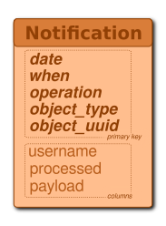

Architecture
============

## Presentation

Indigo is an open source Data Management System designed for large-scale storage.
It provides distributed, robust and extensible storage capabilities, coupling
an object store to an easy to use trigger/rules system.
Indigo is essentially a classic separation of the catalogue from the data. That
is, you keep all the essential information about the object in one place,
optimized for directory type operations, and you store the object itself
elsewhere.  This is how traditional file systems work and classically how any
cataloguing system works, because there are many occasions where you want to
process the data about the object without actually accessing the data itself.
The catalogue provides so called CRUD operations for both metadata and objects
themselves, where CRUD is an acronym for Create, Update, Read and Delete.

This schema shows the different components of the system

The next sections will present each components more precisely.

## Presentation Layer

### [Indigo Web Interface](https://github.com/Indigo-Uliv/indigo-web)

The Web Interface is served on each node of the Indigo cluster. It is powered by
Django/Nginx and provides a simple interface to the Data Management System via a
Web browser.

All the CRUD functions are available through the interface and it displays the
hierarchy of the data objects/collections created in the system.

### [Indigo Command Line Interface](https://github.com/Indigo-Uliv/indigo-cli)

Indigo CLI is an independent Python client and command line tool that can be
used to dialog with an Indigo cluster. It uses Indigo RESTful APIs to communicate
with the system.

## Web Services Layer

### [CDMI API](https://github.com/Indigo-Uliv/indigo-web)

The [Cloud Data Management Interface](https://www.snia.org/cdmi) defines the
functional interface that applications will use to create, retrieve, update and
delete data elements from the cluster. As part of this interface the client is
able to discover the capabilities of the cloud storage offering and use this
interface to manage containers and the data that is placed in them. In addition,
metadata can be set on containers and their contained data elements through this
interface.

Indigo supports a large part of the 1.1.1 specification.

### [Admin API](https://github.com/Indigo-Uliv/indigo-web)

The Indigo Admin RESTful API allows the remote management of the system. It
provides functions to manage users and groups.

## Application Layer

### CRUD

Indigo implements the four basic functions of persistent storage, Create, Read,
Update and Delete for Collections and Data Objects.

### Search

Indigo provides minimal search capabilities on Collections and Data Objects names
and metadata.

It uses its own indexes stored in Cassandra tables.

### Listener

The listener is a daemon that executes user scripts written in Python when
events trigger on the Indigo Management System.

When a user-defined script is triggered, it is passed the topic as a command
line argument, and metadata about the object is given in JSON format through
`stdin`. The environment the script is executed in is a Docker container running
Python 3.4.3, the script is executed as the user `nobody`.

### Notification System

When *create*, *update*, or *delete* operations are performed on either a
*collection*,  a *resource* (*container* and *data object* respectively ibn CDMI
nomenclature), a *user* or a *group*, a message is sent to a MQTT broker running
on the local machine containing information about the operation and resource.

An additional row is written in a Cassandra table for audit purpose.

## Domain Layer

### Metadata Catalog

Metadata Catalog is stored as a set of tables in Cassandra. It describes how
the data is replicated on the cluster machines.

#### Data Storage Schema

This schema shows the different tables Indigo is using to manage data resources
and collections.

A data object is a resource stored as a blob in Cassandra. It is uniquely
identified by its _uuid_ and it can be split in several rows using the
_sequence_number_ part of the primary key.

A row in the TreeEntry represents an object in the Indigo hierarchy. This can
be a collection or a resource. Each row uses static columns to link to the
parent container metadata, to reduce the number of queries needed when selecting
a row to get information. For resources the _url_ column is used to link to the
actual binary data. If the data is stored in Cassandra we use the url
"cassandra://object_uuid". Otherwise the url locates the binary data to an
external data store.

#### Users and Groups Schema

This schema shows the different tables Indigo is using to manage users and
groups.

Indigo uses the names as primary keys to optimize the queries as its more
frequent to look for users given their names than their uuid.

#### Search Schema

The _SearchIndex_ table is a minimal implementation of search capabilities. It's a
lookup table which stores the terms associated to an object (names, metadata
name or values, ...). Search isn't efficient and will have to be replaced by
something more robust, probably using DSE Search.

#### Notification Schema

The _Notification_ table stores every operation that took place in the system.
It is a duplication of the messages which is sent to the MQTT queue that can be
analyzed later to audit the system.

### Graph Schema

Indigo manages the data in a hierarchy of collections and resources. In parallel,
it creates a graph representation of the entities of the system to explore
different relations between components of the system (collections, resources,
user and groups).

Metadata are stored as properties of the vertices.

## Infrastucture Layer

### Cassandra Repository

By default, Indigo stores the resources binary data as blobs chunks in a Cassandra
table. These binary datas are linked to the Indigo hierarchy via their UUID.

### External Repositories

We are using the CDMI references to link the binary data of a resource to an
external repository. The reference object exists in the Indigo hierarchy, with
the possibility to create metadata, ACL, ... but the actual data is stored
somewhere else.
