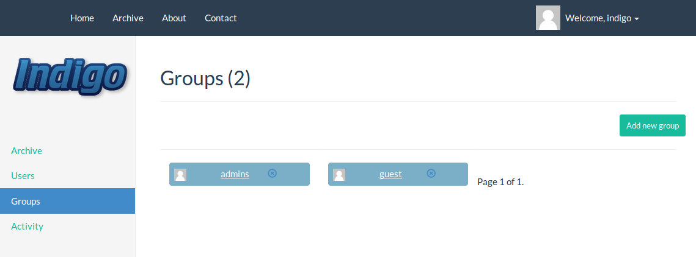
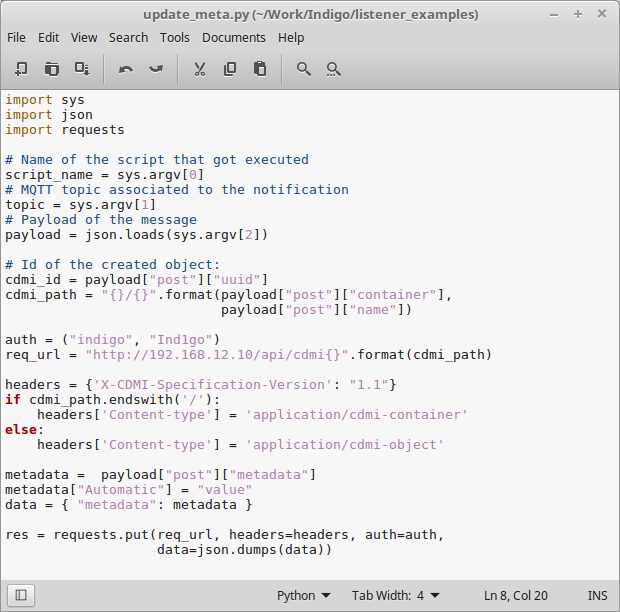

Screenshots of a working Indigo cluster
======================================

* Login

  - This picture shows the login screen of the Indigo Web server which can be
  installed on different nodes of the cluster.

    

  - By default Indigo stores a combination of user/password on its own database. It
  is possible to replace this behaviour and validate a user using an LDAP server

    

* Manage Users

  - A list of users defined in the system

    

  - From the web interface it is possible to edit some part of the users profile.
    The Command Line tools allow a finer control of the users.

    

* Manage groups

  - A list of groups defined in the system

    

  - Membership can be modified thorugh the interface. That's important as groups
    are used to define ACLs on collections and resources.

    

* Navigate in the Hierarchy

  - The archive menu on the left displays the hierarchy of the collections/resources
    stored in the system.

    

  - It is possible to create/edit collections from the web interface. The
    permissions (ACLs) are defined for the existing groups in the system. metadata
    are key/value pairs.

    

  - Resources are digital objects managed by the system, either stored in the
    Indigo database or linked to an external URL. The resource view display the
    CDMI URL that can be used from another client to access the resource.

    

  - As for collections, resources can have associated ACLs and metadata.

    

* The Listener

  - The listener is looking for the scripts it handles in the special collection
    __'/script'__. This collection ACLs can be edited so only administrators can
    modify it.

    

  - When a new script is created in the __'/script'__ collection, the listener
    registers it to a specific topic. This is defined via the __topic__ metadata.
    This script is accociated to the topic string __create/+/test/#__, it is
    activated when anything (__+__) is created (__create__) in the collection
    /test or lower in the hierarchy (__/test/#__).

    

  - This is an example of a python script that automatically adds metadata to
    a resource uploaded on the cloud.

    

  - This shows the result of an update script which has created some metadata
    when the resource has been created in the /test collection.

   
